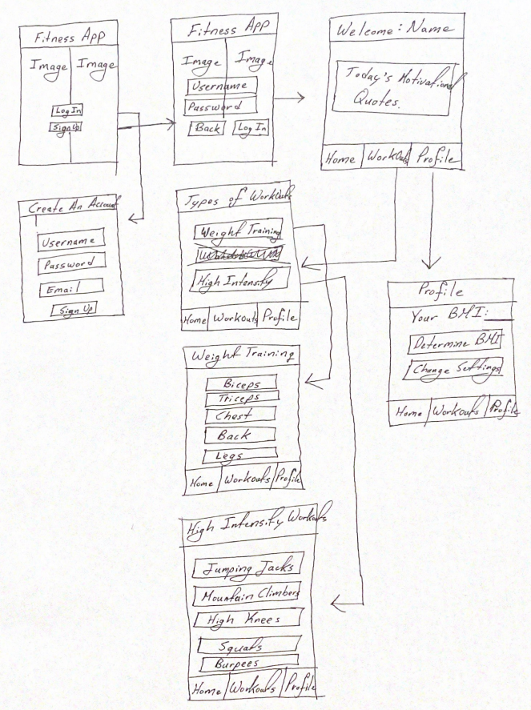

# FITNESS APP

## Table of Contents
1. [Overview](#Overview)
1. [Product Spec](#Product-Spec)
1. [Wireframes](#Wireframes)
2. [Schema](#Schema)

## Overview
### Description
This is a fitness App that user can use to track their workouts and progress in the gym. The app would also give user multiple workouts to try out based on their BMI.

### App Evaluation
[Evaluation of your app across the following attributes]
- Category: Health & Fitness
-Mobile: Primarily a mobile app iPhone users
-Story: Helps users with workouts and fitness
-Market: Anyone can choose to use the app and would find it helpful
-Habit:The app could be used daily or depending on users fitness level
-Scope: First we would help user with basic fitness needs. Later, we can add finding training partners, groups, and food tracking. 

## Product Spec

### 1. User Stories (Required and Optional)

**Required Must-have Stories**

* User can login to see their progress and also Logout
* User chooses the type of workouts
* Add motivational quote API
* Profile screen setup

**Optional Nice-to-have Stories**

* Meal prep ideas
* Random workout selection
* Connecting to other users

### 2. Screen Archetypes

* Login
* Register
   * user signs up
* Profile
  * Daily workout calories 
  * Muscle worked out
* Home
   * motivational quotes 
   * suggestions 
* Workout
   * Types of workouts: Weight Training or High Intensity Workouts

### 3. Navigation

**Tab Navigation** (Tab to Screen)

* Home
* Workouts
* Profile

**Flow Navigation** (Screen to Screen)

* Forced Log-in 
    *  Account creation if no log in is available
* Workout Selection 
   * choose the type of workouts
* Profile 
   * change settings
   * calculate BMI


## Wireframes
[Add picture of your hand sketched wireframes in this section]


### [BONUS] Digital Wireframes & Mockups

### [BONUS] Interactive Prototype

## Schema 
## Models

### Post 
|   Property       | Type           |   Description        |
| -----------------|----------------|----------------------| 
|ObjectID          |String          |Unique id for each user post |
|Author 	|pointer to the user |	Users information |
|Image	|File	|Profile picture 
|Progression	|Number 	|Number of workouts done in a week |
|TimeSpend 	|DateTime	|Amount of time spend on a workout|
|Selection	|Array 	|Which workout was done throughout the week| 


### Networking
List of network requests by screen

* SignIn/SignUp
  * (Create/POST) Create a new user account.
    ```
    let query = PFQuery(className:"Post")
    query.whereKey("author", equalTo: currentUser)
    query.order(byDescending: "createdAt")
    query.findObjectsInBackground { (posts: [PFObject]?, error: Error?) in
       if let error = error {
          print(error.localizedDescription)
       } else if let posts = posts {
          print("Successfully retrieved \(posts.count) posts.")
          // TODO: Do something with posts...
       }
    }
    ```
  * (Read/GET) Query the user information.

* Home Screen
  * (Create/POST) Create a new like on the quote.
  * (Delete/DELETE) Delete an existing like.
  * (Read/GET) Read a users last workout date.

* Workout
  * (Create/POST) Make a new workout selection.
  * (Delete/DELETE) Unselect a workout choice.
  * (Update/PUT) Time spent for a workout.
  * (Update/PUT) Muscles workout out.

* Profile
  * (Read/Get) Query logged in user object.
  * (Update/PUT) Update user profile image.
  * (Update/PUT) Get current day workout progress.
  * (Read/GET) Get last workout details.
